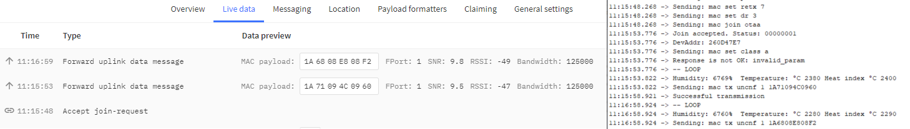
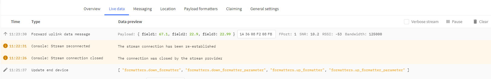

# Temperature & Humidity (with SODAQ ExpLoRer)
This guide is a continuation of the `Getting Started with the SODAQ ExpLoRer Guide`  and will make use of the application (on The Things Network) and device (SODAQ ExpLoRer) set up during that guide. If you haven't followed the previous guide you will need to do that first, and  have:
- The SODAQ ExpLoRer connected correctly, with an antenna
- The SODAQ ExpLoRer connected your computer, and communicating correctly
- The Arduino IDE installed
- The `MCCI LoRaWAN LMIC library` installed and configured correctly, and
- The SODAQ ExpLoRer registered and communicating with The Things Network

## What you will need
To follow this guide, you will The setup from the previous guide, with the addition of:
- A Keyestudio DHT22 Temperature and Humidity Sensor Module
- A breadboard and 3 wires OR some other way to connect the sensor to the SODAQ ExpLoRer

You will still need to be in range of a Gateway connected to The Things Network which you can find out about [here](https://www.thethingsnetwork.org/community).

## Step 1 - Install Library
Install a library to help use the soil moisture sensor.

In the Arduino IDE:
- Go to `Tools -> Manage Libraries`
- Search for `DHT22` using the search box
- Install the `DHT sensor library` library
    - If asked to _install missing dependencies?_, choose _Install all_


## Step 2 - Setup the board
To connect the sensor to the SODAQ ExpLoRer we will be using a breadboard.

A breadboard has a number of rows typically labelled with numbers and a number of columns typically labelled with letters. To learn more about breadboards and how to use them, follow this [link](https://learn.sparkfun.com/tutorials/how-to-use-a-breadboard/all).

Building on the setup completed in `Getting Started with the SODAQ ExpLoRer guide`:

1. Insert the pins from the DHT22
    - Each leg should be in a different row, but the same column.
1. In the same numbered row that the sensors GND pin is connected to insert a wire into the breadboard and connect it to one of the GND sockets on the SODAQ ExpLoRer.
1. In the same numbered row that the sensors VCC pin is connected to insert a wire into the breadboard and connect it to the 5V socket on the SODAQ ExpLoRer.
1. In the same numbered row that the sensors S (or DAT) pin is connected to insert a wire into the breadboard and connect it to the D2 socket on the SODAQ ExpLoRer.


## Step 3 - Setup the Code
Now that the sensor is connected to the Sodaq Explorer the code needs to be modified from the `Getting Started with the SODAQ ExpLoRer guide` to send the sensor data instead of the static letters in the myData variable.

> Make sure you get the code from the `Getting Started with the SODAQ ExpLoRer Guide` which importantly has the APPEUI and APPKEY configuration correct.

Open up a copy of the Arduino IDE code you created in the `Getting Started with the SODAQ ExpLoRer guide`.

At the top of the code under the `#include <TheThingsNetwork.h>` line, add the following code `#include "DHT.h"`

After the `#define freqPlan TTN_FP_AU915` line include the following:

```C++
#define DHTPIN 2 // Digital pin connected to the DHT sensor
#define DHTTYPE DHT22   // DHT 22  (AM2302), AM2321

DHT dht(DHTPIN, DHTTYPE);
```

The first few lines of the program should now look like this:

```C++
#include <TheThingsNetwork.h>
#include "DHT.h"

// Set your AppEUI and AppKey
const char *appEui = "0000000000000000";
const char *appKey = "00000000000000000000000000000000";

#define loraSerial Serial2
#define debugSerial SerialUSB

// Replace REPLACE_ME with TTN_FP_EU868 or TTN_FP_US915
#define freqPlan TTN_FP_AU915

#define DHTPIN 2 // Digital pin connected to the DHT sensor
#define DHTTYPE DHT22   // DHT 22  (AM2302), AM2321
```

>NOTE: you should have a valid appEui and appKey already from code you created in the `Getting Started with the SODAQ ExpLoRer guide`.

At the bottom of the `setup()` function add `dht.begin();`

```C++
void setup()
{
  ...

  debugSerial.println("-- JOIN");
  ttn.join(appEui, appKey);

  dht.begin();
}
```

Replace the `loop()` function with the following code

```C++
void loop()
{
  debugSerial.println("-- LOOP");

  // Reading temperature or humidity takes about 250 milliseconds!
  // Sensor readings may also be up to 2 seconds 'old' (its a very slow sensor)
  float humidity = dht.readHumidity();
  float temperature = dht.readTemperature();

  // Check if any reads failed and exit early (to try again).
  if (isnan(humidity) || isnan(temperature)) {
    debugSerial.println(F("Failed to read from DHT sensor!"));
    return;
  }

  // Multiply by 100 to convert to remove decimal places
  int humidityInt = humidity * 100;
  int temperatureInt = temperature * 100;
  int heatIndexInt = dht.computeHeatIndex(temperature, humidity, false) * 100;


  //Break the humidity, temperature and heat index into Bytes in individual buffer arrays
  byte payloadA[2];
  payloadA[0] = highByte(humidityInt);
  payloadA[1] = lowByte(humidityInt);
  byte payloadB[2];
  payloadB[0] = highByte(temperatureInt);
  payloadB[1] = lowByte(temperatureInt);
  byte payloadC[2];
  payloadC[0] = highByte(heatIndexInt);
  payloadC[1] = lowByte(heatIndexInt);

  //Get the size of each buffer array (in this case it will always be 2, but this could be used if they were variable)
  int sizeofPayloadA = sizeof(payloadA);
  int sizeofPayloadB = sizeof(payloadB);
  int sizeofPayloadC = sizeof(payloadC);

  //Make a buffer array big enough for all the values
  byte payload[sizeofPayloadA + sizeofPayloadB + sizeofPayloadC];

  //Add each of the individual buffer arrays the single large buffer array
  memcpy(payload, payloadA, sizeofPayloadA);
  memcpy(payload + sizeofPayloadA, payloadB, sizeofPayloadB);
  memcpy(payload + sizeofPayloadA + sizeofPayloadB, payloadC, sizeofPayloadC);

  //Print some outputs for debugging
  debugSerial.print(F("Humidity: "));
  debugSerial.print(humidityInt);
  debugSerial.print(F("%  Temperature: "));
  debugSerial.print(F("°C "));
  debugSerial.print(temperatureInt);
  debugSerial.print(F(" Heat index °C "));
  debugSerial.println(heatIndexInt);

  // Send it off
  ttn.sendBytes(payload, sizeof(payload));

  //Wait 60 second between readings
  delay(60000);
}
```
### What does this do?
Every 60 seconds this will:
1. Read the Humidity and Temperature values from the sensor.
1. Calculate the heat index and multiply the humidity, temperature, and heat index by 100 so that the **integers** now have 2 decimal points of precision
    - We can convert them back to decimal at The Things Network end.
1. Convert the numbers into a buffer array of bytes that can be sent to The Things Network.
    - You can learn more about this process [here](https://www.thethingsnetwork.org/docs/devices/bytes.html).
1. Queue the data stored in `payload` for transmission.

### Testing
1. Connect the SODAQ ExpLoRer to your computer using the USB cable.
1. In the Arduino IDE ensure that the correct port is selected by going to `Tools -> Port:` and check that the SODAQ ExpLoRer's port is selected
1. Ensure that the correct board is selected by going to `Tools -> Board: <...> -> SODAQ SAMD (32-bits ARM Cortex-M0+) Boards -> SODAQ ExpLoRer` and selecting the SODAQ ExpLoRer.
1. Finally click the arrow button in the top left to upload your code to the Arduino.
1. You should see a 'successful upload' message in the bottom of the Arduino IDE

After it has finished uploading you can check the monitor at `Tools -> Serial Monitor` to see if it is working. You should see it connect to The Things Network, make measurements and send those measurements.

You can also now go to the `Data` tab on your The Things Network application to see the data being sent.

*Remember: Don't be worried if it fails to connect a few times*



## Step 4 - Decoding the message
Now that we have encoded the message and sent it to The Things Network we need to tell the things network what to do with it.

In your application on The Things Network, go to the tab named `Payload Formats`. In here we can write code to decrypt the data we get from our device.

Enter the following into the decoder:
```C++
function Decoder(bytes, port) {
  // Decode an uplink message from a buffer
  var decoded = {};
  //Separate the individual numbers into individual buffers
  var Val1 = bytes.slice(0, 2);
  var Val2 = bytes.slice(2, 4);
  var Val3 = bytes.slice(4, 6);

  //Convert the buffers into numbers and divide by 100 to return them to 2 decimal places
  //Then save them to the decoded array
  decoded.myValA = ((Val1[0] << 8) + Val1[1]) / 100;
  decoded.myValB = ((Val2[0] << 8) + Val2[1]) / 100;
  decoded.myValC = ((Val3[0] << 8) + Val3[1]) / 100;

  //return the values
  return {
    field1: decoded.myValA,
    field2: decoded.myValB,
    field3: decoded.myValC,
  };
}
```

The Code first separates the long buffer array we created in the Arduino code back into the buffers that make up the Humidity, temperature, and heat index.

It then decodes each of the buffers into numbers, divides the numbers by 100 to turn them back into their original values and saves them into the decoded array.

Finally the numbers are returned as field 1, field 2 and field 3.


Be sure to click the `save payload functions` button at the bottom!

### The Decoded Message

You can also now go to the `Data` tab on your The Things Network application to see the data being sent, just like before, but now the "decoded" values are shown as well.


